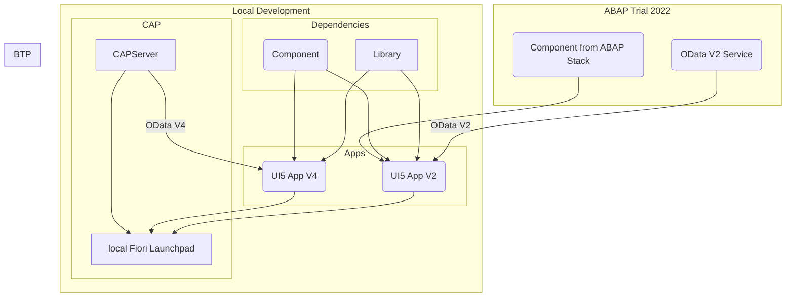
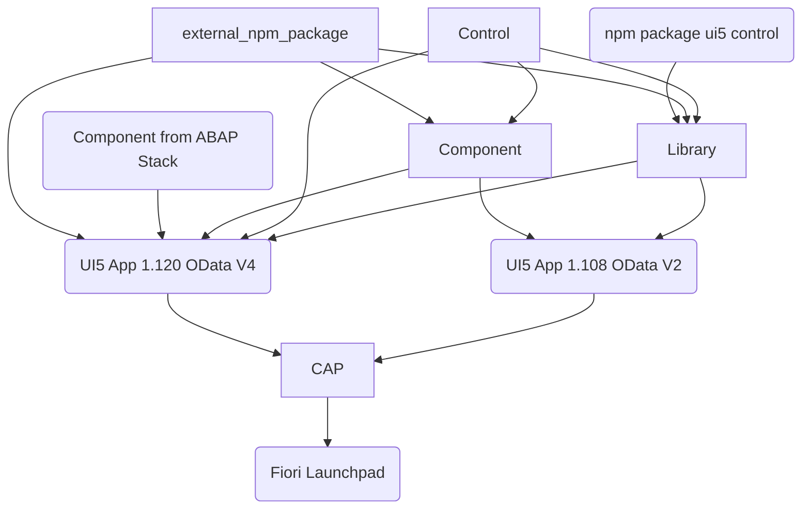

# UI5con dev environment

This repository showcases a advanced development environment for UI5 and CAP projects.

## Setup

To run the local CAP App, you need to run the following commands:

```bash
git clone https://github.com/marianfoo/ui5con24-dev-env
cd ui5con24-dev-env
mkdir packages/component/dist
pnpm i
pnpm start:server:setup
pnpm start
```

This will start the CAP server and the UI5 App. The related UI5 ABAP App needs a running ABAP Trial 2022 system with UI5 Spreadsheet Component deployed.

## Deploy

### Deploy to BTP

### Deploy to ABAP

For running the app in the ABAP, you need to deploy this local Component and Library and the UI5 Spreadsheet Importer.
Adapt the yaml files for the deployment to your system.

```bash
pnpm run deploy:abap:app
pnpm run deploy:abap:lib
pnpm run deploy:abap:comp
```

## Current used packages

- ui5-middleware-livereload
- ui5-middleware-serveframework
- ui5-middleware-simpleproxy
- ui5-middleware-ui5
- ui5-tooling-modules
- ui5-tooling-transpile
- cds-launchpad-plugin
- cds-plugin-ui5

## TODO

- [ ] Add CAP deployment @lemaiwo
- [ ] Add ABAP Deployment
- [ ] Add UI5 Control
  - [ ] add UI5 Control to Library
  - [ ] add UI5 Control to UI5 App
- [ ] add external UI5 Package to App
- [ ] add external npm Package to App
- [ ] add external npm Package to Library
- [ ] add external npm Package to Component
- [X] duplicate UI5 App with UI5 1.108 and OData V2

## current setup



## target setup


