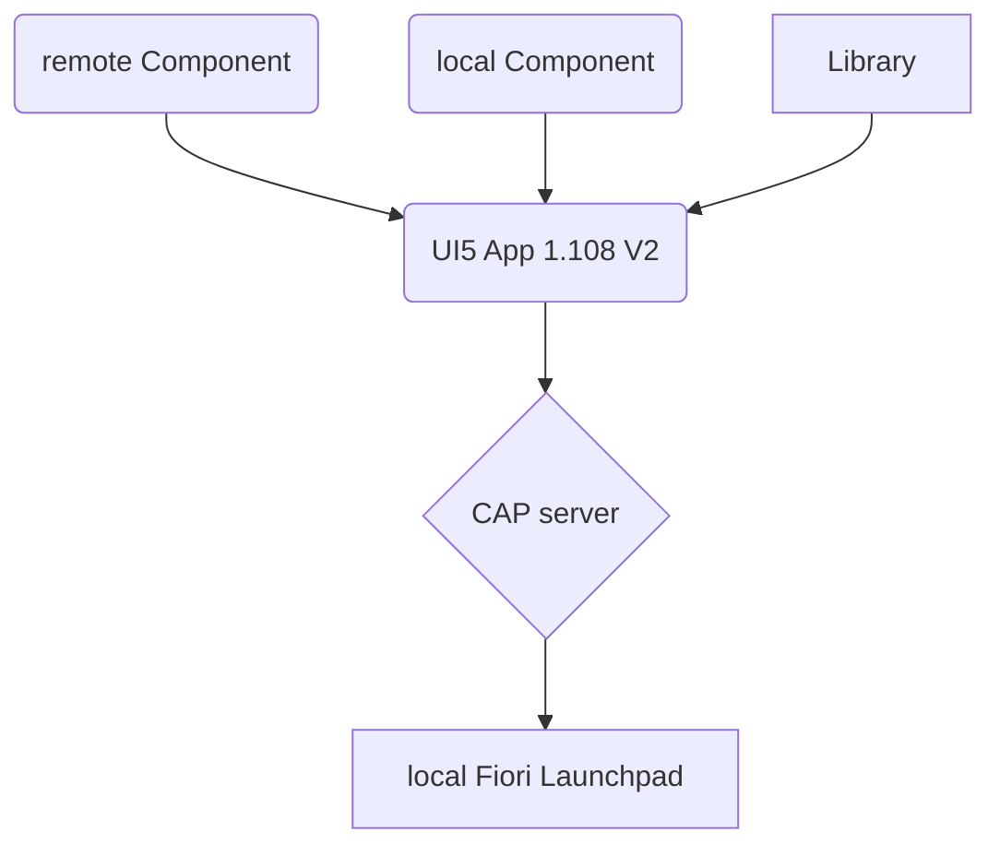
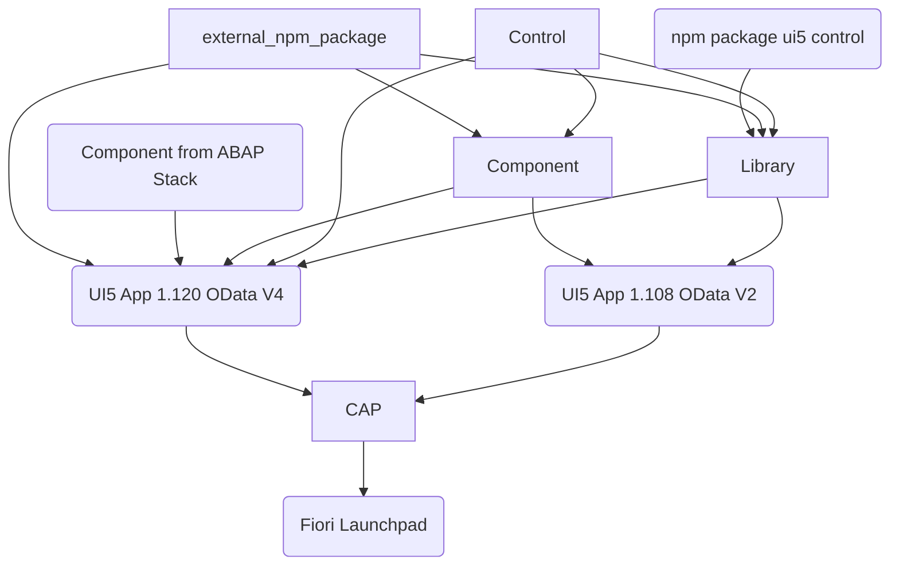

# UI5con dev environment

This repository showcases a advanced development environment for UI5 and CAP projects.

## TODO

- [ ] Add CAP deployment @lemaiwo
- [ ] Add ABAP Deployment
- [ ] Add UI5 Control
  - [ ] add UI5 Control to Library
  - [ ] add UI5 Control to UI5 App
- [ ] add external UI5 Package to App
- [ ] add external npm Package to App
- [ ] add external npm Package to Library
- [ ] add external npm Package to Component
- [ ] duplicate UI5 App with UI5 1.108 and OData V2

## current setup

## target setup

